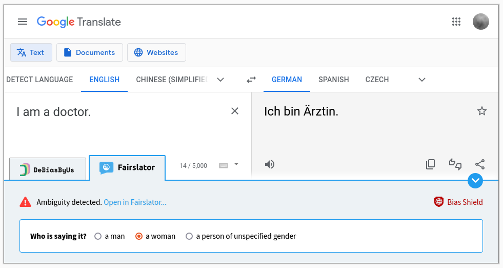

# Bias Shield

This is **Bias Shield**, a browser extension which adds bias-handling features to [Google Translate](https://translate.google.com/) and [DeepL Translator](https://www.deepl.com/translator). Bias Shield springs into action while you're using one of these online translators and gives you access to the following debiasing tools:

- [**DeBiasByUs**](https://debiasbyus.ugent.be/): You can use Bias Shield to report gender-biased translations to DeBiasByUs, a project which is building a database of gender-biased translations. Also, Bias Shield warns you when the translation you have been given has previously been reported as gender-biased, and offers you an unbiased translation instead (if one is available).

- [**Fairslator**](https://www.fairslator.com/): Bias Shield lets you make use of Fairslator, an application which automatically detects and corrects biases caused by ambiguities in gender, number and forms of address.

## Building

Make sure you have [Node.js](https://nodejs.org/) installed, then run `node build`. This creates two (Git-ignored) subfolders in this repository, `built_for_chrome` and `built_for_firefox`.

## Installing for testing

- In Firefox: Open the `about:debugging` page, click the *This Firefox* option, click the *Load Temporary Add-on* button, then select any file in the `built_for_firefox` directory. The extension now installs, and remains installed until you restart Firefox.

- In Chrome (or Chromium): Go to `chrome://extensions/`, turn on *Developer mode* in the top-right corner, click the *Load unpacked button* and select the `built_for_chrome` directory.

## Credits

- Shield icon: [Iqbal Widianto/The Noun Project](https://thenounproject.com/icon/shield-5472411/)
- Check and warning icons: [Font Awesome](https://fontawesome.com/)

## Docs for developing browser extensions

- Firefox: https://developer.mozilla.org/en-US/docs/Mozilla/Add-ons/WebExtensions
- Chrome: https://developer.chrome.com/docs/extensions/

## Submitting browser extensions to stores and directories

- Firefox: https://addons.mozilla.org/developers/
- Chrome: https://chrome.google.com/webstore/devconsole/